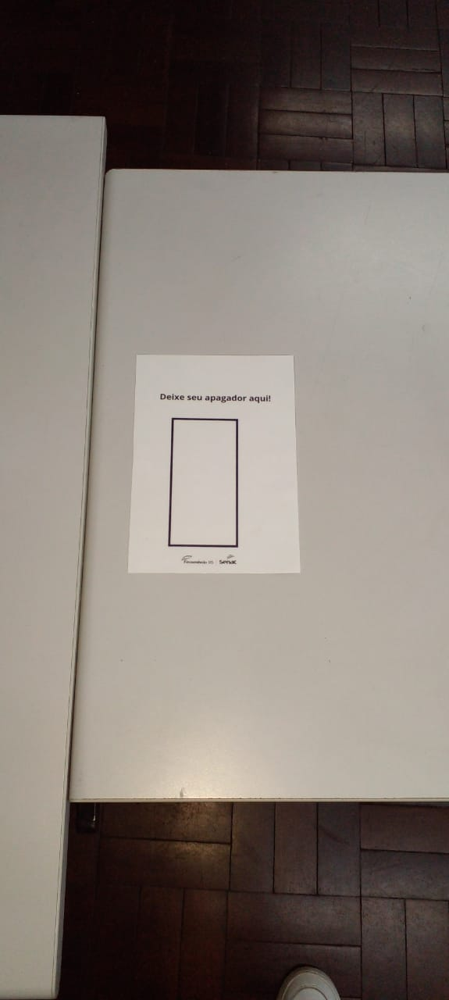
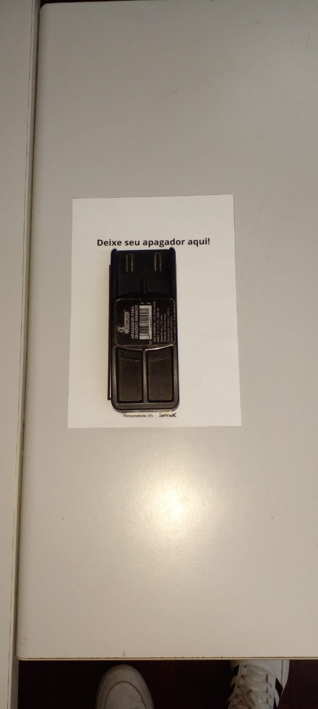

# Comunica TECH 20241219

> # PIDS 10
>
> 

> 

> # Aniversário prof. Miguel
> 

> # Aninversariantes de dezembro!
> -	Aniversário do Jair dia 27/12;
> -	Aniversário da Cintia dia 31/12;

> # Administrativo
> -	Férias da Flaviana dia 26/12;
> -	Retorno das férias da Milene, Eduarda e Luana F.;
> -	Confraternização dia 20/12 das 11h às 16h na AFISVEC da Cavalhada

> # Pedagógico
>
>  Vitórias da Semana:
> 
> - Formatura Capacita, hoje! 19/12
> - ⁠Start no GT do evento Silver Day (futuramente entram mais envolvidos)
> - Encerramento ano letivo! (Palmas)
> 
> Próxima Semana:
>
> - Dia 26/12 reunião pedagógica das 9h às 16h
> 
> 

 

> ## Excelência
> 
> <video controls>
>  <source src="IMG_2452.MOV" type="video/mov">
>    </video> 
>

### Apagadores
> 

> 

>
> 

> 

> ## Direção 
>
>

> 
> Agradeço ao time Senac Tech por todo apoio, confiança, respeito, amizade e comprometimento. Vocês são incríveis e são o brilho da nossa escola! Obrigada por tanto e parabéns por mais um ano de muitas vitórias e conquistas!

> ## Infra
>
> Esta semana a Infra-TI deseja a todos um feliz Natal e um próspero ano novo!
